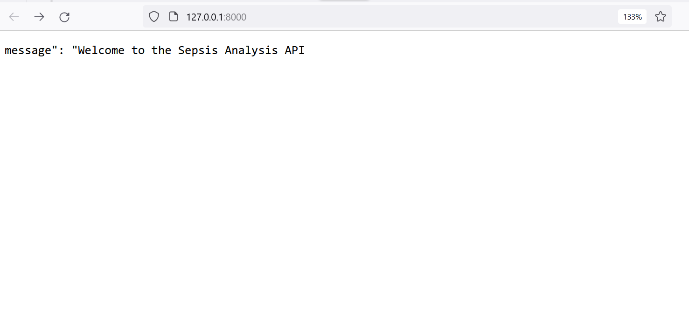
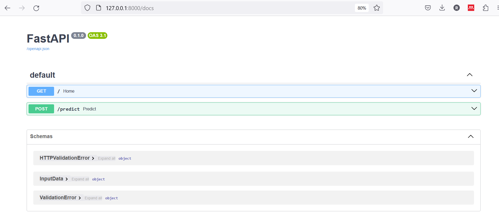
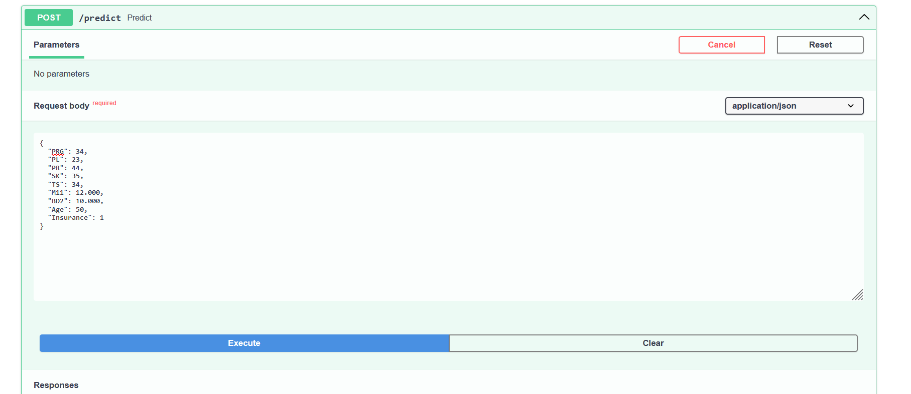
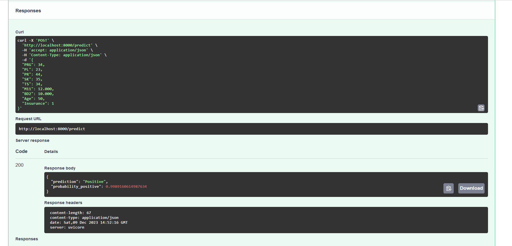

# Sepsis-Prediction-Model-LP6

[](LICENSE)
[](https://travis-ci.org/regina.crabbe/Sepsis-Prediction-Model-LP6)
[]()

## Overview
This project aims to predict the likelihood of sepsis in patients using machine learning. It involves the analysis of various medical features and the development of a predictive model. Additionally, a FastAPI has been created for easy integration into healthcare systems.

## Table of Contents
## Overview
1. [Introduction](#introduction)
2. [Objective](#objective)
3. [Project Goal](#project-goal)
4. [Project Structure](#project-structure)
   1. [Datasets](#1-datasets)
   2. [Model](#2-model)
   3. [Root Directory](#3-root-directory)
5. [Data](#data)
   - [Source](#source)
   - [Data Features](#data-features)
   - [Preprocessing](#preprocessing)
6. [Exploratory Data Analysis (EDA)](#exploratory-data-analysis-eda)
   - [Data Shape](#data-shape)
   - [Descriptive Statistics](#descriptive-statistics)
   - [Outlier Detection](#outlier-detection)
   - [Univariate Analysis](#univariate-analysis)
   - [Bivariate Analysis](#bivariate-analysis)
   - [Multivariate Analysis - Logistic Regression](#multivariate-analysis---logistic-regression)
7. [Modeling](#modeling)
   - [Machine Learning Models](#machine-learning-models)
   - [Summary of Classification Reports](#summary-of-classification-reports)
8. [Summary Report of Models using Class Weights](#summary-report-of-models-using-class-weights)
9. [Hyperparameter Tuning](#hyperparameter-tuning)
10. [Making Predictions on Test Data](#making-predictions-on-test-data)
11. [Saved Pipeline and Encoder](#saved-pipeline-and-encoder)
12. [Sepsis Analysis API Development](#sepsis-analysis-api-development)
   - [Introduction](#introduction-1)
   - [Endpoints](#endpoints)
   - [Error Handling](#error-handling)
13. [Usage](#usage)
   - [Prediction](#prediction)
14. [Development of FastAPI](#development-of-fastapi)
   - [Local Development](#local-development)
   - [Docker Deployment of Sepsis Analysis FastAPI](#docker-deployment-of-sepsis-analysis-fastapi)
15. [Dependencies](#dependencies)
16. [Setup](#setup)
17. [Project Summary](#project-summary)
   - [Code](#code)
   - [Name of Project](#name-of-project)
   - [Published Article](#published-article)
   - [Deployed App](#deployed-app)
18. [License](#license)
19. [Acknowledgment](#acknowledgment)
20. [Author](#author)
21. [Profile Picture](#profile-picture)
22. [Contact](#contact)


## Introduction
Sepsis is a severe and potentially life-threatening medical condition that occurs when the body's response to an infection becomes dysregulated, leading to widespread inflammation and organ dysfunction. Recognized as a medical emergency, sepsis demands immediate attention and intervention. Timely detection is critical for effective treatment and improved patient outcomes.

## Objective
The primary objective of this project is to develop a machine learning model capable of predicting the likelihood of sepsis. Additionally, the aim is to integrate this predictive model into a FastAPI application, creating a user-friendly and efficient tool for healthcare professionals. 

## Project Goal
The goal of this project is to empower medical practitioners with a reliable system for sepsis detection, facilitating timely interventions and ultimately enhancing patient care and outcomes.

## Project Structure

The project follows a structured approach based on the CRISP-DM framework, ensuring systematic steps are taken to achieve meaningful results. Here's an overview of the main folders and their purposes:

### 1. Datasets
   - **Location:** `/datasets`
   - **Purpose:** Contains the training and testing datasets. These datasets serve as the foundation for model training and evaluation.

### 2. Model
   - **Location:** `/Model`
   - **Contents:**
     - `logistic_regression_model.joblib`: Joblib file containing the saved preprocessor and the best model for prediction.
     - `label_encoder.joblib`: Joblib file containing the saved label encoder for encoding the sepsis feature.
     - `notebook.ipynb`: Jupyter notebook documenting from the Business undrstanding through to the model development process and saving the model and encoder.

### 3. Root Directory
   - **Contents:**
     - `main.py`: FastAPI application script. This is the main entry point for deploying and serving the model through FastAPI.
     - `Dockerfile`: Specifies the instructions for building a Docker container to encapsulate the project and its dependencies.
     - `requirements.txt`: Lists the Python dependencies required to run the project.
     - `README.md`: Provides an overview of the project, including its structure, purpose, and instructions for usage.

     - Virtual Environment (venv)
     - **Purpose:** Contains the Python virtual environment. This ensures a consistent and isolated environment for the project. 
     - Version Control (`.gitignore`)
     - **Purpose:** Specifies files and directories that should be ignored by version control (Git). This includes the virtual environment, cache files, and other artifacts that don't belong in the repository.
     - Cache
     -  __pycache__/
   
## Data
### Source
  - The dataset used for this project is sourced from [Kaggle](https://www.kaggle.com/). The datasets are the Patients Files Train data and  Patients Files Test data.

### Data Features
  - ID: Patient ID
  - PRG: Plasma glucose
  - PL: Blood Work Result-1
  - PR: Blood Pressure
  - SK: Blood Work Result-2
  - TS: Blood Work Result-3
  - M11: Body mass index
  - BD2: Blood Work Result-4
  - Age: Patient's age
  - Insurance: Insurance status (binary)
  - Sepsis: Target variable (Positive or Negative)

### Preprocessing

- **Handling Missing Values:** No missing values were found in the dataset.

- **Handling Duplicate Values:** No duplicate values were found in the dataset.

## Exploratory Data Analysis (EDA)

- **Data Shape:**
  - Training Dataset: (599, 11)
  - Testing Dataset: (169, 10)

- **Descriptive Statistics:**
  - Descriptive statistics were computed to provide insights into the distribution and characteristics of numeric features within the dataset. 
  - Based on the mean, median, and visual inspection, features like 'PL' (Blood Work Result-1) and 'PR' (Blood Pressure) appear to have distributions that are closer to normal, with symmetric shapes. Other features exhibit skewness to varying degrees.
  - Checked Outliers : Boxplots helped to identify the presence of outliers in each numeric variable. Out of the variables, blood work result-3 (TS) and blood work result-4 (BD2) had a lot of outliers specifically, above the maximum whiskers. Blood Pressure (PR) and Body Mass Index (M11)  had outliers at both sides of the whiskers. Blood Work Result-2 (SK) and Blood Work Result-1 (PL) had only one outlier outside the whiskers.

  **Outlier Detection:**
  - Identified outliers in numeric variables using box plots.
  Blood work result-3 (TS) and blood work result-4 (BD2) had a lot of outliers specifically, above the maximum whiskers. Blood Pressure (PR) and Body Mass Index (M11)  had outliers at both sides of the whiskers. Blood Work Result-2 (SK) and Blood Work Result-1 (PL) had only one outlier outside the whiskers.

- **Univariate Analysis:**
  - The distribution of the target column Sepsis was investigated:
    There was a higher count of negative cases compared to positive cases in 'Sepsis'. 

- **Bivariate Analysis:**
  - The relationship between numeric variables was investigated. This exploration helped uncover potential correlations or patterns between pairs of features, contributing to a more comprehensive understanding of the dataset.
  - There was a positive correlation between 'PRG' and 'Age', indicating that as plasma glucose increases, age tends to increase as well. 'PL' and 'TS' also showed a positive correlation. ‘SK' and 'Age' had a negative correlation, indicating that as blood work result-2 decreases, age tends to increase. Some variables showed weak correlations close to zero, such as 'M11' and 'Insurance'.

  
## Data Analysis 
### Univariate and Bivariate Analysis
These were the questions that guided the study.

1. **What is the distribution of plasma glucose levels in the dataset?**
   - The distribution of PRG levels in the dataset is right-skewed, with a higher frequency of lower values (towards the left side of the histogram).

2. **Is there a significant difference in plasma glucose levels between patients who    develop sepsis and those who do not?**
   - The Mann-Whitney U test, also known as the Wilcoxon rank-sum test, is a non-parametric statistical test used to assess whether there is a difference between two independent, non-normally distributed groups.
   - **Result of Mann-Whitney U test:**
   - This suggests that there is evidence supporting the idea that plasma glucose levels differ between patients who develop sepsis and those who do not.

3. **What is the average BMI among patients who develop sepsis?**
   - The histogram helped to visualize the distribution of Body Mass Index (BMI) among patients who developed sepsis.
   - **Result:**
   - The average BMI of 35.39 suggests the typical BMI among patients who developed sepsis. 

4. **Is there a difference in body mass index (BMI) between patients with and without sepsis?**
   - The Mann-Whitney U test assesses whether there is a significant difference in Body Mass Index (BMI) between patients with and without sepsis.
   - **Result of Mann-Whitney U test:**
   - There is evidence supporting the idea that BMI values differ between patients who developed sepsis and those who did not.

5. **Is there a specific age range where the likelihood of sepsis is higher?**
   - This analysis explores whether there is a specific age range where the likelihood of sepsis is higher.
   - **Result:**
   - Each row in the table corresponds to an age group, and the columns indicate the percentage of patients with and without sepsis in each group. In age groups 20-29, 30-39, 40-49, and 50-59, the percentage of patients with sepsis is higher than in the older age groups. Notably, in the 70-79 and 80-89 age groups, there are no patients with sepsis based on the dataset.

6. **Is the impact of insurance status on sepsis likelihood consistent across different age groups?**
   - The stacked bar chart helped to visualize the distribution of sepsis cases across different age groups, considering insurance status.
   - **Result:**
   - The stacked bar chart displays the distribution of sepsis cases across different age groups, with a further breakdown based on insurance status (Positive or Negative). In the 20-29, 30-39, and 60-69 age groups, the proportion of sepsis cases appeared higher among patients without insurance compared to those with insurance. In the age groups 40-49 and 50-59, the proportion of sepsis cases appeared higher among patients with insurance compared to those without insurance.

### Multivariate Analysis - Logistic Regression
   - Logistic regression was used to analyse the hypothesis stated. 
   - **Logistic regression** is a type of multiple regression used for predicting binary outcomes, and it is a suitable approach for analyzing the impact of multiple predictor variables (independent variables) on a binary categorical target variable (dependent variable).
   - The logistic regression model showed that the p-values for Age, Plasma Glucose (PRG), and Body Mass Index (M11) were less than the alpha value(0.01). This implies that they are statistically significant predictors of the likelihood of Sepsis.
   - Based on the results, we rejected the null hypothesis and concluded that Age, Plasma Glucose (PRG) and Body Mass Index (M11) have a statistically significant impact on the likelihood of Sepsis.

## Modeling

### Machine Learning Models

In this project, several machine learning models were trained and evaluated to predict the likelihood of sepsis based on various features in the dataset. The best model was chosen for further prdictions on unseen data.

1. **K-Nearest Neighbors (KNN) Classifier:**
   - Trained the first model using the K-Nearest Neighbors (KNN) Classifier.
   - Achieved an overall accuracy of 71% on the test set.
   - Demonstrated moderate performance with imbalances in precision and recall for the two classes.

2. **Logistic Regression (Gradient Descent):**
   - Trained the second model using Logistic Regression with Gradient Descent.
   - Achieved an overall accuracy of 75% on the test set.
   - Showed improved performance compared to KNN, with balanced precision and recall.

3. **Decision Tree (Decision Tree):**
   - Trained the third model using the Decision Tree algorithm.
   - Achieved an overall accuracy of 73% on the test set.
   - Exhibited reasonable performance with an accuracy of 73%.

4. **Random Forest:**
   - Trained the fourth model using the Random Forest algorithm.
   - Achieved an overall accuracy of 72% on the test set.
   - Demonstrated reasonable performance with an accuracy of 72%.

5. **XGBoost (Extreme Gradient Boosting):**
   - Trained the fifth model using XGBoost.
   - Achieved an overall accuracy of 68% on the test set.
   - Demonstrated fair performance with an accuracy of 68%.

6. **Gaussian Naive Bayes:**
   - Trained the sixth model using the Gaussian Naive Bayes algorithm.
   - Achieved an overall accuracy of 69% on the test set.
   - Showed moderate performance with balanced precision and recall.

7. **Neural Network (TensorFlow and Keras):**
   - Trained the last model using a Neural Network.
   - Achieved an overall accuracy of 70% on the test set.
   - Demonstrated moderate performance with a balanced accuracy of 70%.

### Summary of Classification Reports

- The following metrics provide a comprehensive view of each classifier's performance, considering precision, accuracy, recall, and F1-Score. Logistic regression showed a balanced performance across these metrics, making it a strong candidate for predicting the likelihood of sepsis. 

## Balance the Class in Sepsis
- Class weight was used to address the the class imbalance in sepsis. All the seven models were trained again using class weights. This is to ensures that the model pays more attention to the minority class, potentially improving its ability to correctly predict instances of the minority class.

### Summary Report of Models using Class Weights
- The Logistic Regression model with class weights performed best with precision of 75.4%, recall of 72.5%, F1-Score of 73.1% and accuracy of 72.5%. This model shows a good balance between precision and recall, making it a suitable choice for predicting the likelihood of sepsis. 

## Hyperparameter Tuning
Hyperparameter Tuning systematically searches for the best set of hyperparameters for the algorithm to optimize its performance. It improves the model's performance and also controls the complexity of the model.
- Utilized grid search for hyperparameter tuning on the Logistic Regression model.
- Best hyperparameters: {'C': 1, 'penalty': 'l1', 'solver': 'liblinear'}

## Making Predictions on Test Data
The logistic regression model, as the best-performing model, demonstrates its effectiveness in distinguishing between patients with and without sepsis. 

- The metrics showed a balanced classification across both classes, with a weighted precision of 74.8%, weighted recall of 72.5%, and a weighted F1-score of 73.0%. The model demonstrates robust performance in predicting the likelihood of sepsis, considering both positive and negative instances.

## Saved Pipeline and Encoder
The model's pipeline and encoder were saved to be used for further predictions on unseen data.

## Sepsis Analysis API Development
### Introduction

The Sepsis Analysis API is a predictive tool designed to assess the likelihood of sepsis based on specific input parameters. This API incorporates a logistic regression classifier, trained on historical data, to deliver rapid and automated sepsis predictions.

### Endpoints

### 1. Prediction Endpoint

- **Path:** `/predict`
- **Method:** POST
- **Description:** Makes predictions for sepsis likelihood based on input data.
- **Request Parameters:**
  - `PRG`: Plasma glucose.
  - `PL`: Blood Work Result-1.
  - `PR`: Blood Pressure.
  - `SK`: Blood Work Result-2.
  - `TS`: Blood Work Result-3.
  - `M11`: Body mass index.
  - `BD2`: Blood Work Result-4.
  - `Age`: Age of the patient.
  - `Insurance`: Insurance status (Binary: 0 for Negative, 1 for Positive).

- **Response Format:**
  - Successful Response:
    ```json
    {
      "prediction": "Positive",
      "probability_positive": 0.75
    }
    ```
  - Error Response:
    ```json
    {
      "error": "Error making prediction: Details about the error."
    }
    ```

### Error Handling

- The API provides informative error messages in case of an exception during prediction.
- The response includes an `error` field with details about the encountered error.
- Proper HTTP status codes are used to indicate the success or failure of the request.

### Usage

**Prediction:**
   - Send a POST request to `/predict` with the required parameters.
   - Receive a JSON response with the predicted class (`Positive` or `Negative`) and the probability of the positive class.

## Development of FastAPI

### Local Development
For local development, run the API using the following steps:

### Install Dependencies:
```bash
pip install -r requirements.txt
```
Run the API:
Start the FastAPI application by running:
```
    uvicorn main:app --reload
```
    The API will be available at http://127.0.0.1:8000.

Access API Documentation:

    Visit http://127.0.0.1:8000/docs in a browser to access the documentation.


## Docker Deployment of Sepsis Analysis FastAPI

-  Used the official Python 3.9 image as the base image
- Set the working directory in the container
- Copied the current directory contents into the container 
- Installed any needed packages specified in requirements.txt
- Expose port 8000 to the world outside this container
- Run app.py when the container launches

```
   CMD ["uvicorn", "main:app", "--host", "0.0.0.0", "--port", "8000"]
```
### Prerequisite

Install Docker on your machine. Download Docker from the official website: [Docker](https://www.docker.com/get-started).

### Build Docker Image
    docker build -t sepsisanalysis-fastapi-app 

### Run Docker container
    docker run -p 8000:8000 sepsisanalysis-fastapi-app 

### Dependencies
Dependencies installed before running the project:

- Python 3.9
- FastAPI
- Uvicorn
- Joblib
- Scikit-learn
- Pandas
- NumPy
- Matplotlib
- Seaborn
- TensorFlow
- Keras
- XGBoost

Install the dependencies using the following command:

    pip install -r requirements.txt

## Setup

Steps to set up the project locally:

### 1. Clone the Repository:

    git clone https://github.com/reginacrabbe/Sepsis-Prediction-Model-LP6.git
    cd Sepsis-Prediction-Model-LP6
### 2. Create Virtual Environment:
    python -m venv venv
### 3. Activate Virtual Environment:
    .\venv\Scripts\activate


## Usage
Provinstructions on how to use the project, including running the models and making predictions.

### 1. Setup

Before using the project, ensure that you have set up the environment as described in the Setup section of the README. This includes cloning the repository, creating a virtual environment, and installing the required dependencies.

### 2. Run the FastAPI Application Locally

```bash
uvicorn main:app --reload
```
- This command starts the FastAPI application locally. The API will be accessible at http://127.0.0.1:8000.

    **Interface of FastAPI**



### 3. Access API Documentation

- Visit http://127.0.0.1:8000/docs in a web browser to access the API documentation. The documentation provides details on the available endpoints, request parameters, and response formats.

    **Interface of FastAPI Documentation**



### 4. Make Predictions
Using the Prediction Endpoint
-   Open the API documentation page at http://127.0.0.1:8000/docs.
-   Navigate to the /predict endpoint.
-   Input the required parameters (PRG, PL, PR, SK, TS, M11, BD2, Age, Insurance) for making predictions.
-    Click on the "Execute" button to get predictions.

**Prediction Interface**



**Example cURL Request**

**Prediction Result Interface**



## Project Summary

|Code|Name of Project|Published Article|Deployed App|
|:---|:-------------:|:---------------:|-----------:|
|LP6 |Sepsis Analysis FastAPI |https://medium.com/@rndcrabbe/real-time-api-for-sepsis-likelihood-prediction-using-machine-learning-and-fastapi-7955077e593b|Medium|

## License

This project is licensed under the [MIT License](LICENSE).

## Acknowledgment

- Thank you very much Azubi Teachops and the entire Azubi Team for the support, dedication and invaluable lessons and guidance provided throughout our learning journey. The Teachops team has been instrumental in imparting knowledge and fostering a collaborative learning environment.

## Author
- Regina Naa Dedei Crabbe

## Profile Picture


## Contact
Regina Naa Dedei Crabbe
- Email: rndcrabbe@gmail.com
- Medium: https://medium.com/@rndcrabbe
- Linkedin: https://www.linkedin.com/in/regina-crabbe-ab11a5284/
